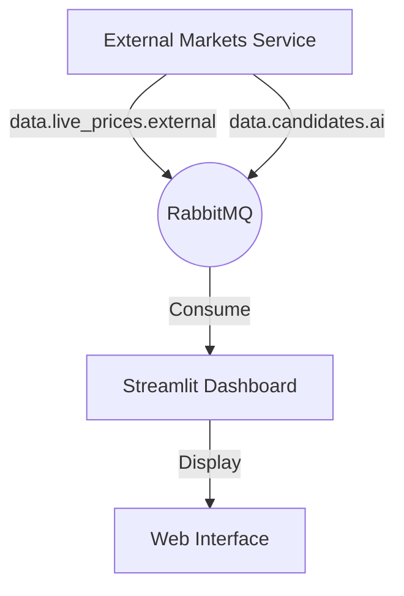

# Plan: Real-time Analysis Dashboard (Streamlit)

## 1. Goal
Create a visual dashboard that displays real-time prices and detailed trading signals (candidates) generated by the `external-markets-service`.

## 2. Architecture
The dashboard will run as a separate service (or tool) and consume data from RabbitMQ.

## 3. Technical Stack
- **Framework:** [Streamlit](https://streamlit.io/)
- **Data Source:** RabbitMQ (via `pika`)
- **State Management:** Streamlit Session State + Background Thread for RabbitMQ consumption

## 4. Components
### 4.1. Price Ticker (Sidebar/Header)
- Real-time display of prices for Forex, Stocks, and Metals.
- Visual indicators (green/red) for price changes.

### 4.2. Candidates Feed (Main View)
- Table/Cards for new trading signals.
- Detailed view of indicators: EMA crossovers, RSI, MACD, etc.
- Correlation data (S&P500, DXY).

### 4.3. Alerts Log
- History of triggered events for the current session.

## 5. Implementation Steps
1. **Update Dependencies:** Add `streamlit` and `watchdog` (for dev) to `requirements.txt`.
2. **RabbitMQ Consumer:** Create a background thread that listens to `data.live_prices.external` and `data.candidates.ai`.
3. **UI Layout:**
    - Sidebar for configuration and status.
    - Main area with two tabs: "Live Prices" and "AI Candidates".
4. **Data Formatting:** Reuse existing logic from `src/logic/payload_validator.py` or similar to ensure data integrity.
5. **Docker Integration:** Update `docker-compose.yml` to include the dashboard.

## 6. Files to be created/modified
- `src/tools/dashboard.py`: Main dashboard application.
- `requirements.txt`: Add streamlit.
- `docker-compose.yml`: Add `dashboard` service.
